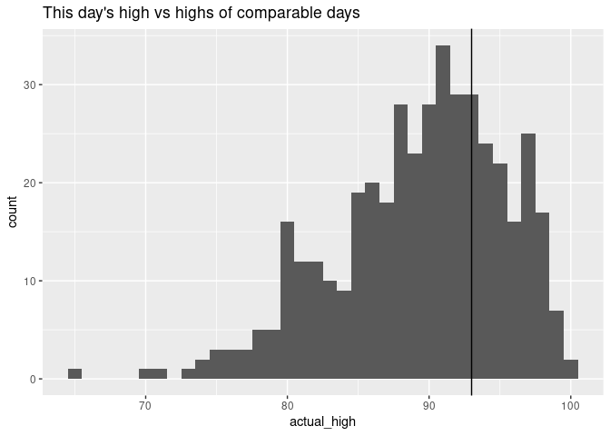
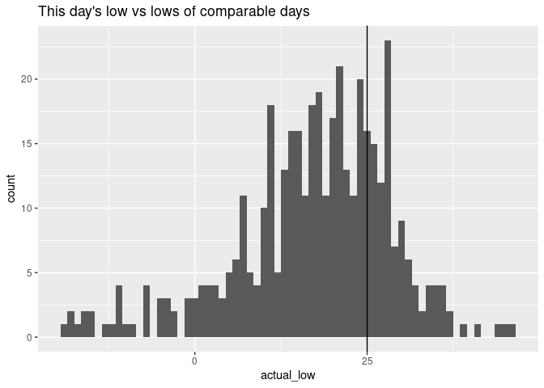

# den-weather

## Denver Weather Patterns

## References

- <https://www.ncei.noaa.gov/data/global-summary-of-the-day/doc/readme.pdf>

# High/Low data for 2024-03-03

## Updated at

2024-03-06 11:15:12 MST

## Highs

This day’s high of **69.1F** was in the **eighty-ninth percentile** for
highs in similar days.  
The last time the high was this high (or higher) was **2024-03-02**,
when the high was **69.1F**.

## Lows

This day’s low of **28.9F** was in the **seventy-seventh percentile**
for lows in similar days.  
The last time the low was this low (or lower) was **2024-03-02**, when
the low was **28.9F**.

## TODO

- [x] Format Daily
- [x] Today’s low was in the \_\_th percentile for similar days (+/- 7
  days)
- [x] Today’s low was the coldest since \_\_\_
- [ ] Today’s low was the warmest since \_\_\_
- [ ] Today’s high was the coldest since \_\_\_
- [x] Today’s high was the warmest since \_\_\_
